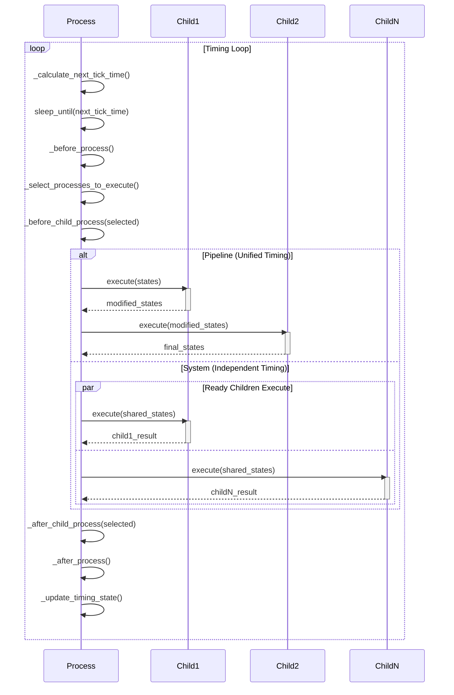
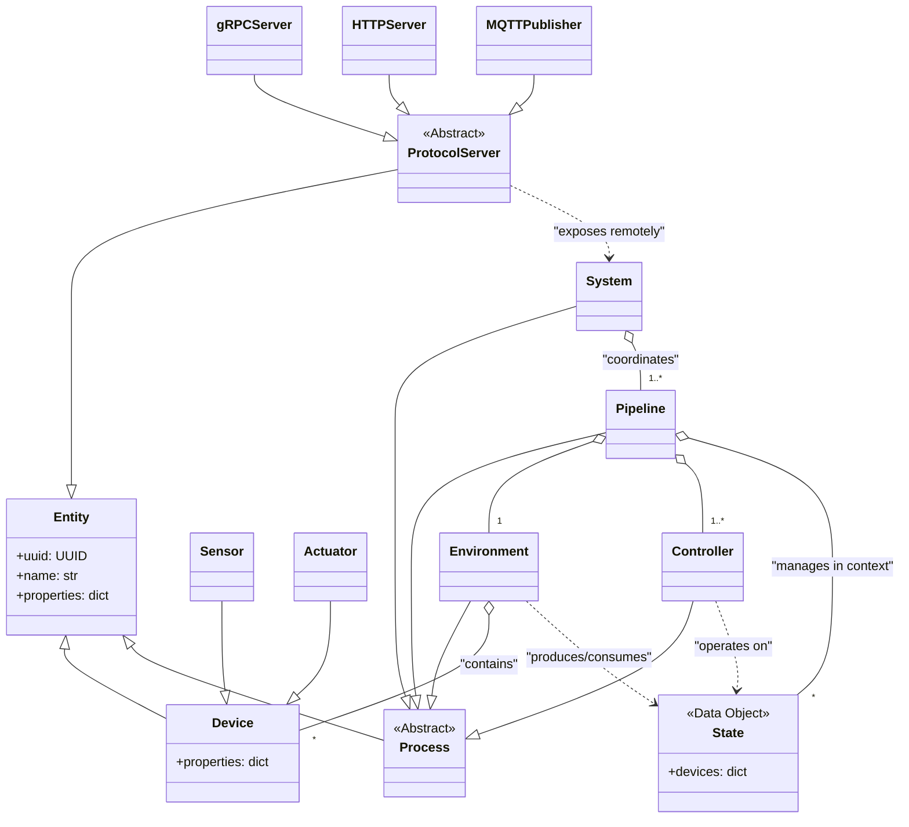

# aifand Architecture

This document outlines the software architecture for `aifand`, an adaptive thermal management system designed for both local and remote operation across multiple network protocols.

## Core Philosophy

The `aifand` architecture automatically discovers and learns the thermal properties of hardware without manual configuration. It separates pure data (`State`) from logic that transforms it (`Process`), enabling complex behaviors through composable building blocks. The system supports multiple network protocols for remote monitoring and control while maintaining a single source of truth through pydantic models.

## Key Abstractions and Data Models

### Entity

The `Entity` class serves as the foundational base for all objects within the system. Each entity has a unique identifier (`uuid`) and human-readable name, with support for arbitrary additional properties through pydantic's `extra="allow"` configuration.

**Implementation details:**
- Inherits from `pydantic.BaseModel` with `frozen=True` for immutability
- Automatic UUID generation via `uuid4()` if not provided
- Supports arbitrary key-value pairs alongside core fields
- Full JSON serialization/deserialization support
- String representation shows all fields for debugging

All core classes (`Device`, `Process`, `System`) inherit from `Entity` to ensure consistent identification, serialization, and extensibility across the architecture.

### Data Models

The `Device` class represents a single interface point with hardware. It extends Entity with a flexible properties dictionary storing arbitrary key-value pairs like value, min, max, label, hwmon_path, scale, and unit. Standard property naming conventions ensure consistency across thermal management operations.

Two specialized device types exist: `Sensor` for reporting values from the environment (temperature, fan RPM), and `Actuator` for performing actions (fan PWM control, thermal limits).

A `State` represents a snapshot of device properties at a specific moment, implemented as an immutable collection of Devices indexed by name. States are unopinionated about their meaning; their role (like "actual" or "desired") is defined by how a `Process` uses them. States provide helper methods for device access, addition, and removal while maintaining immutability through copy-on-write semantics.

### Process

The `Process` class represents computational units that transform data within the system. Processes support two execution modes: immediate execution via `execute()` for stateless transformations, and timing-driven execution via `start()` for autonomous thermal control loops. This design enables both simple transformations (Controllers, Environments) and complex coordination (Pipeline, System).

**Immediate Execution Mode:**
- **Stateless operation**: `execute()` receives dictionary of named states, returns transformed states
- **Serial pipeline**: Child processes execute in order with state passthrough
- **Immutable data flow**: Input states are deep-copied to prevent modification
- **Error resilience**: Exceptions caught, logged, execution continues with passthrough behavior
- **Pipeline manipulation**: Dynamic child addition, insertion, and removal
- **Per-process logging**: Each process gets its own hierarchical logger

**Timing-Driven Execution:**
- **Autonomous operation**: `start()` method runs timing loop until `stop()` called
- **Template method pattern**: Overridable methods define timing and execution strategies
- **Coordination hooks**: Before/after process hooks enable parent-child communication
- **Graceful shutdown**: Responsive stop mechanism with cleanup

**Timing Infrastructure (Optional):**
Process subclasses can implement timing-driven execution by overriding these methods:
- `_calculate_next_tick_time()`: When should the next execution occur?
- `_select_processes_to_execute()`: Which child processes are ready to execute?
- `_execute_selected_processes()`: How should selected processes be executed?
- `_before_process()` / `_after_process()`: Coordination hooks around execution
- `_before_child_process()` / `_after_child_process()`: Hooks around child execution

**Execution behavior:**
- If a process has no children, it executes its own `_process()` method
- If a process has children, execution strategy depends on timing implementation
- Failed processes log errors but don't abort thermal control (critical for safety)
- PermissionError exceptions bubble up as programming errors (unlike operational failures)

**Pipeline manipulation:**
- `append_child(process)` - Add process to end of pipeline
- `insert_before(target_name, process)` - Insert process before named target (raises ValueError if not found)
- `insert_after(target_name, process)` - Insert process after named target (raises ValueError if not found)
- `remove_child(name)` - Remove process by name (returns bool indicating success)

These methods enable dynamic pipeline construction and reconfiguration, particularly useful for System classes that need to build execution pipelines based on discovered hardware or operating conditions.

**Device modification permissions:**
The system enforces thermal management domain rules through runtime permission validation. Environment processes can read and modify both Sensors and Actuators (hardware interface responsibility), while Controller processes can only modify Actuators (decision-making responsibility). This separation prevents Controllers from corrupting sensor readings while allowing proper thermal control. Permission checking uses call stack inspection to identify the modifying process and validates against a class-based permission matrix with inheritance support.

An `Environment` can read and modify sensors, but should only read actuators from its input state. `Simulation` environments may model virtual hardware responses, while `Hardware` environments interface with real hardware via Linux hwmon.

A `Controller` can read and modify actuators, but should only read sensors from its input state. Controllers contain decision-making logic that determines actuator settings based on sensor readings.

### Pipeline

The `Pipeline` class implements unified timing coordination for thermal control through Environment → Controllers stages. Pipeline extends Process with timing-driven execution using a unified timing strategy where all children execute together at the same interval, preserving serial execution order and state flow. Pipeline manages a single logical control flow, such as CPU thermal management or GPU thermal management.

**Unified Timing Strategy:**
- All children execute serially at pipeline interval (default 100ms)
- Maintains Environment → Controllers execution order
- Single shared interval ensures coordinated thermal control
- State flows serially through pipeline stages
- Preserves existing thermal control patterns

**Timing Implementation:**
Pipeline implements the Process timing infrastructure for unified execution:
- `_calculate_next_tick_time()`: Returns next execution time based on pipeline interval
- `_select_processes_to_execute()`: Returns all children for unified execution  
- `_execute_selected_processes()`: Executes children as serial pipeline

**State Management:**
- Maintains `states: Dict[str, State]` field with persistent states between executions
- Supports both autonomous timing-driven execution and embedded Process execution
- In autonomous mode, repeatedly executes pipeline and updates persistent states
- In embedded mode, processes input states from parent System

**Configuration and Conventions:**
- Uses nanosecond time units with `interval_ns` field and `time.time_ns()` scheduling
- Modulo-based timing ensures consistent intervals regardless of execution duration  
- Follows Environment → Controllers convention with helper methods `set_environment()` and `add_controller()`
- Overrideable `get_time()` method supports alternative time sources

**Quality and Safety:**
- Devices include `timestamp` and `quality` fields for operational state tracking
- Only Environment processes update sensor timestamps and quality
- Immutable State design with deep copying ensures safe execution
- Error resilience prevents thermal control loop interruption

### System

The `System` class implements independent timing coordination for multiple thermal control flows. System extends Process with timing-driven execution using an independent timing strategy where children execute when their individual timing requirements are met, enabling coordination across thermal zones with different update rates and thermal characteristics.

**Independent Timing Strategy:**
- Each child process operates on its own preferred interval
- Children execute when ready, not in predetermined order
- Shared state coordination through persistent states
- Parent-child communication via coordination hooks
- Enables thermal zones with different response characteristics

**Timing Implementation:**
System implements the Process timing infrastructure for independent execution:
- `_calculate_next_tick_time()`: Finds earliest child ready time across all children
- `_select_processes_to_execute()`: Returns children whose timing requirements are met
- `_execute_selected_processes()`: Executes ready children independently

**Execution Characteristics:**
- **Serial execution**: Due to Python's GIL, execution remains serial but in timing-determined order
- **Shared state access**: Children read/write System's persistent states independently
- **Coordination hooks**: `_before_child_process()` and `_after_child_process()` enable coordination
- **"Any news for me?" pattern**: Children can request updates from parent System
- **Failure isolation**: Individual child failures don't abort System execution

**Operational Patterns:**
- **Independent zones**: CPU, GPU, storage thermal management with different update rates
- **Distributed systems**: Remote thermal management nodes with network coordination
- **Hierarchical control**: Systems containing other Systems for data center management
- **Cross-zone coordination**: Thermal policies that span multiple thermal zones

**Architecture Benefits:**
- Enables thermal zones with natural timing differences (fast sensors, slow actuators)
- Supports coordination without forced synchronization
- Scales from single-machine to data center thermal management
- Maintains thermal control safety through failure isolation

#### Timing-Driven Execution Pattern

The Process timing infrastructure follows a template method pattern:

## Concrete Implementations

### Environments

The `Hardware` environment interfaces with physical hardware through the Linux hwmon filesystem. It discovers available sensors and actuators, populates device lists, and implements read/apply methods for real-world interaction.

The `Simulation` environment creates virtual worlds with mathematical thermal models. Multiple simulation types support controller testing: LinearThermal, ThermalMass, RealisticSystem, UnstableSystem, FailureSimulation, and ChaosSystem.

### Controllers

The `SafetyController` implements fail-safe logic, monitoring actual state against critical thresholds and overriding other controllers when triggered. It executes last in the controller pipeline.

The `PIDController` implements standard Proportional-Integral-Derivative control with anti-windup and derivative filtering. Multiple instances can control independent loops.

The `LearningController` uses Echo State Networks to learn thermal relationships and optimize for multiple objectives like efficiency and noise.

## Class Hierarchy

## Protocol Layer Architecture

The protocol layer enables remote thermal management across multiple network protocols while maintaining protocol-agnostic core logic. All protocols expose the same underlying pydantic thermal models through different transport mechanisms.

### Protocol Use Cases

The architecture supports multiple network protocols, each optimized for specific thermal management scenarios. gRPC provides high-frequency sensor data streaming, real-time control commands, and authenticated remote management for performance-critical applications. HTTP/REST handles configuration management, status queries, and integration with web dashboards for administrative interfaces. MQTT enables distributed sensor networks, IoT device integration, and pub/sub thermal alerts for scalable monitoring architectures. WebSocket delivers real-time dashboard updates and live thermal monitoring for interactive user interfaces. Prometheus supports metrics collection, alerting, and performance monitoring for operational observability.

## Serialization Strategy

The architecture assumes that pydantic models serve as the single source of truth for all data structures. This ensures consistency across all protocols and eliminates schema drift.

### Core Serialization Features

The serialization strategy centers on single schema definition where thermal entities are defined once as pydantic models and exposed across multiple protocols including gRPC, HTTP, MQTT, and WebSocket. Protocol stubs generate automatically from pydantic models, providing full type checking across network boundaries while supporting arbitrary properties for flexible key-value extension without protocol changes.

### Protocol-Specific Adaptations

Each protocol adapts the common pydantic models to its specific requirements. gRPC uses `pydantic-rpc` to automatically generate protobuf definitions from pydantic models, while HTTP relies on direct FastAPI integration with pydantic models. MQTT employs JSON serialization via `model_dump_json()` for lightweight message passing. WebSocket enables real-time streaming of pydantic model updates for interactive interfaces, and Prometheus extracts metrics directly from pydantic model properties for observability.

## Remote Communication

Both Systems and Pipelines can communicate across networks using any supported protocol. Systems can coordinate multiple remote Pipelines, while Pipelines can operate independently across network boundaries through protocol-specific clients, enabling distributed thermal management across multiple machines or data centers.

### Hierarchical Composition

Systems can be composed hierarchically, with higher-level Systems managing collections of Pipelines or lower-level Systems. Remote Pipelines can appear as virtual devices to parent Systems, while remote Systems can be managed by higher-level coordination Systems, enabling scalable thermal management architectures.

## Testing Strategy

The architecture supports comprehensive testing through multiple approaches targeting different system layers and integration points. Unit tests provide individual component validation with pytest, ensuring each class and method operates correctly in isolation. Pipeline tests validate complete Pipeline execution and controller integration, verifying that Environment and Controller processes coordinate properly within sequential execution flows. System tests focus on multi-Pipeline coordination and parallel execution validation, ensuring that Systems correctly manage multiple independent Pipelines and aggregate their results.

Simulation tests evaluate controller behavior against mathematical thermal models, providing controlled environments for testing control algorithms without requiring physical hardware. Hardware tests conduct real-world validation and safety verification using actual thermal management hardware to confirm the system operates correctly under real conditions. Protocol tests verify multi-protocol serialization and network communication, ensuring that thermal data transmits correctly across different network protocols and maintains consistency.

The simulation environments enable testing controller stability against both reasonable thermal models and perverse edge cases including positive feedback, chaotic dynamics, and hardware failures without risking physical hardware damage or system instability.

### Adversarial Simulation Testing

Critical to controller validation is the creation of deliberately pathological thermal environments designed to expose controller instabilities and failure modes. The simulation framework generates varied and pessimal thermal models using deterministic random seeds to ensure reproducible testing across controller implementations.

Simulation environments include parametrically generated thermal models with randomized characteristics that stress different aspects of controller behavior. Seed-based generation ensures that the same pathological thermal conditions can be reproduced for regression testing and controller comparison. The framework creates thermal models with deliberately perverse physics including non-linear responses, chaotic dynamics with sensitive dependence on initial conditions, positive feedback loops designed to induce thermal runaway, sudden discontinuities and bifurcations in thermal behavior, and randomized parameter variations that change during simulation execution.

The goal is comprehensive stress testing where controllers must demonstrate stability across thousands of randomly generated thermal environments, each designed to exploit different potential failure modes. Controllers that "fly off the deep end" under these adversarial conditions indicate fundamental stability problems that would manifest unpredictably in real-world deployment. Only controllers that remain stable across the full spectrum of pathological thermal models are considered suitable for production thermal management.

---

## Implementation Decisions

**Process Timing Infrastructure**: The base Process class includes optional timing infrastructure through overridable methods rather than separate timing classes. This unified approach enables both simple transformations (Controllers, Environments) and complex coordination (Pipeline, System) within the same architectural framework.

**Template Method Pattern**: Timing-driven execution uses a template method pattern where the timing loop structure is fixed but timing strategies are customizable through method overrides. This separation enables Pipeline's unified timing and System's independent timing using the same infrastructure.

**Unified vs Independent Timing**: Pipeline implements unified timing where all children execute together at shared intervals, preserving serial execution order. System implements independent timing where children execute when individually ready, enabling coordination across different thermal response characteristics.

**GIL-Aware Design**: The architecture acknowledges Python's Global Interpreter Lock, designing "independent" timing as serial execution in timing-determined order rather than true parallelism. This simplifies implementation while providing the coordination benefits of independent timing.

**Coordination Hooks**: Before/after process hooks (`_before_process`, `_after_process`, `_before_child_process`, `_after_child_process`) enable parent-child communication and coordination without requiring complex inter-process communication mechanisms.

**Process Interface Improvements**: The base Process class uses `_process()` method for subclass implementations, providing clear separation between framework timing logic and domain-specific processing logic.

**Nanosecond Time Units**: All timing uses `interval_ns` fields and `time.time_ns()` for precision. Overrideable `get_time()` method supports alternative time sources like GPS or NTP synchronization.

**Device Quality Management**: Device properties include `timestamp` and `quality` fields with standard values ("valid", "stale", "failed", "unavailable") for operational state tracking. Only Environment processes update sensor timestamps and quality, preventing Controllers from corrupting sensor metadata.

**Graceful Timing Control**: Modulo-based timing ensures consistent intervals regardless of execution duration. Responsive shutdown through `stop()` method with sleep interruption enables clean thermal control loop termination.