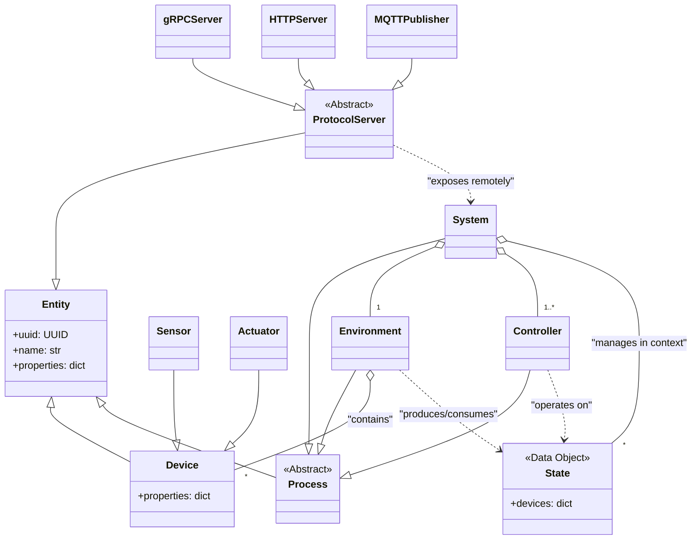

# aifand Architecture

This document outlines the software architecture for `aifand`, an adaptive thermal management system designed for both local and remote operation across multiple network protocols.

## Core Philosophy

The `aifand` architecture automatically discovers and learns the thermal properties of hardware without manual configuration. It separates pure data (`State`) from logic that transforms it (`Process`), enabling complex behaviors through composable building blocks. The system supports multiple network protocols for remote monitoring and control while maintaining a single source of truth through pydantic models.

## Key Abstractions and Data Models

### Entity

The `Entity` class serves as the foundational base for all objects within the system. Each entity has a unique identifier (`uuid`) and human-readable name, with support for arbitrary additional properties through pydantic's `extra="allow"` configuration.

**Implementation details:**
- Inherits from `pydantic.BaseModel` with `frozen=True` for immutability
- Automatic UUID generation via `uuid4()` if not provided
- Supports arbitrary key-value pairs alongside core fields
- Full JSON serialization/deserialization support
- String representation shows all fields for debugging

All core classes (`Device`, `Process`, `System`) inherit from `Entity` to ensure consistent identification, serialization, and extensibility across the architecture.

### Data Models

The `Device` class represents a single interface point with hardware. It extends Entity with a flexible properties dictionary storing arbitrary key-value pairs like value, min, max, label, hwmon_path, scale, and unit. Standard property naming conventions ensure consistency across thermal management operations.

Two specialized device types exist: `Sensor` for reporting values from the environment (temperature, fan RPM), and `Actuator` for performing actions (fan PWM control, thermal limits).

A `State` represents a snapshot of device properties at a specific moment, implemented as a collection of Devices. States are unopinionated about their meaning; their role (like "actual" or "desired") is defined by how a `Process` uses them.

### Process

The `Process` class represents computational units that transform data within the system. Each process maintains a dictionary of named states and an ordered list of child processes forming a serial execution pipeline. The base `Process` class defines an abstract execute method that subclasses implement.

An `Environment` can read and modify sensors, but it can only read actuators in its input state. `Simulation` environments may read virtual actuators in response to an imaginary environment, and write imaginary sensors, but `Hardware` is the base class for the real thing, such as hwmon or the like.

A `Controller` can read and modify actuators, but it can only read sensors in its input state. A controller contains decision-making logic. It receives state objects and produces new state objects representing proposed settings for actuators.

### System

The `System` class orchestrates overall operation, managing an environment and ordered controller pipeline. It maintains named states including current system state ("actual") and target state ("desired"). During each update cycle, the system executes its pipeline in sequence, allowing controllers to transform states toward desired outcomes.

Systems can publish and receive custom composite states from other systems, enabling abstraction and inter-system communication. Because a system is itself a process, it can be included within higher-level systems for multi-layered architectures.

## Protocol Layer Architecture

The protocol layer enables remote thermal management across multiple network protocols while maintaining protocol-agnostic core logic. All protocols expose the same underlying pydantic thermal models through different transport mechanisms.

### Protocol Use Cases

- **gRPC**: High-frequency sensor data streaming, real-time control commands, authenticated remote management
- **HTTP/REST**: Configuration management, status queries, integration with web dashboards
- **MQTT**: Distributed sensor networks, IoT device integration, pub/sub thermal alerts
- **WebSocket**: Real-time dashboard updates, live thermal monitoring
- **Prometheus**: Metrics collection, alerting, performance monitoring

## Serialization Strategy

The architecture assumes that pydantic models serve as the single source of truth for all data structures. This ensures consistency across all protocols and eliminates schema drift.

### Core Serialization Features

- **Single Schema Definition**: Thermal entities defined once as pydantic models
- **Multiple Protocol Support**: Same models exposed via gRPC, HTTP, MQTT, WebSocket
- **Automatic Code Generation**: Protocol stubs generated from pydantic models
- **Type Safety**: Full type checking across network boundaries
- **Arbitrary Properties**: Flexible key-value extension without protocol changes

### Protocol-Specific Adaptations

- **gRPC**: Uses `pydantic-rpc` to automatically generate protobuf definitions from pydantic models
- **HTTP**: Direct FastAPI integration with pydantic models
- **MQTT**: JSON serialization via `model_dump_json()`
- **WebSocket**: Real-time streaming of pydantic model updates
- **Prometheus**: Metric extraction from pydantic model properties

## Concrete Implementations

### Environments

The `Hardware` environment interfaces with physical hardware through the Linux hwmon filesystem. It discovers available sensors and actuators, populates device lists, and implements read/apply methods for real-world interaction.

The `Simulation` environment creates virtual worlds with mathematical thermal models. Multiple simulation types support controller testing: LinearThermal, ThermalMass, RealisticSystem, UnstableSystem, FailureSimulation, and ChaosSystem.

### Controllers

The `SafetyController` implements fail-safe logic, monitoring actual state against critical thresholds and overriding other controllers when triggered. It executes last in the controller pipeline.

The `PIDController` implements standard Proportional-Integral-Derivative control with anti-windup and derivative filtering. Multiple instances can control independent loops.

The `LearningController` uses Echo State Networks to learn thermal relationships and optimize for multiple objectives like efficiency and noise.

## The Execution Pipeline

The system's main loop follows a consistent pattern:

## Class Hierarchy

## Remote System Communication

Systems can communicate across networks using any supported protocol. A local system can monitor and control remote systems through protocol-specific clients, enabling distributed thermal management across multiple machines or data centers.

### Hierarchical Composition

Systems can be composed hierarchically, with higher-level systems managing collections of lower-level systems. Remote systems appear as virtual devices to parent systems, enabling scalable thermal management architectures.

## Testing Strategy

The architecture supports comprehensive testing through multiple approaches:

### Testing Approach
- **Unit Tests**: Individual component validation with pytest
- **Integration Tests**: Complete system pipeline testing
- **Simulation Tests**: Controller behavior against mathematical thermal models
- **Hardware Tests**: Real-world validation and safety verification
- **Protocol Tests**: Multi-protocol serialization and network communication

The simulation environments enable testing controller stability against both reasonable thermal models and perverse edge cases (positive feedback, chaotic dynamics, hardware failures) without risking physical hardware.