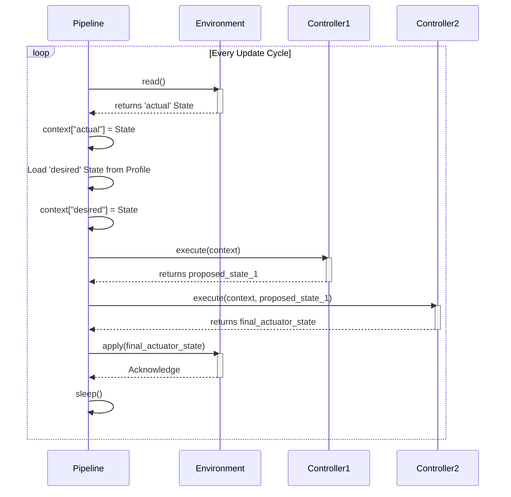
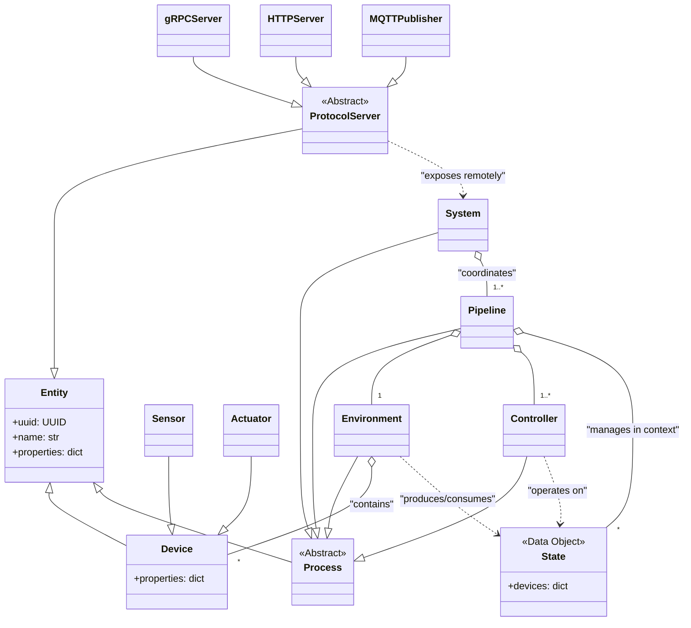

# aifand Architecture

This document outlines the software architecture for `aifand`, an adaptive thermal management system designed for both local and remote operation across multiple network protocols.

## Core Philosophy

The `aifand` architecture automatically discovers and learns the thermal properties of hardware without manual configuration. It separates pure data (`State`) from logic that transforms it (`Process`), enabling complex behaviors through composable building blocks. The system supports multiple network protocols for remote monitoring and control while maintaining a single source of truth through pydantic models.

## Key Abstractions and Data Models

### Entity

The `Entity` class serves as the foundational base for all objects within the system. Each entity has a unique identifier (`uuid`) and human-readable name, with support for arbitrary additional properties through pydantic's `extra="allow"` configuration.

**Implementation details:**
- Inherits from `pydantic.BaseModel` with `frozen=True` for immutability
- Automatic UUID generation via `uuid4()` if not provided
- Supports arbitrary key-value pairs alongside core fields
- Full JSON serialization/deserialization support
- String representation shows all fields for debugging

All core classes (`Device`, `Process`, `System`) inherit from `Entity` to ensure consistent identification, serialization, and extensibility across the architecture.

### Data Models

The `Device` class represents a single interface point with hardware. It extends Entity with a flexible properties dictionary storing arbitrary key-value pairs like value, min, max, label, hwmon_path, scale, and unit. Standard property naming conventions ensure consistency across thermal management operations.

Two specialized device types exist: `Sensor` for reporting values from the environment (temperature, fan RPM), and `Actuator` for performing actions (fan PWM control, thermal limits).

A `State` represents a snapshot of device properties at a specific moment, implemented as an immutable collection of Devices indexed by name. States are unopinionated about their meaning; their role (like "actual" or "desired") is defined by how a `Process` uses them. States provide helper methods for device access, addition, and removal while maintaining immutability through copy-on-write semantics.

### Process

The `Process` class represents computational units that transform data within the system. Processes receive a dictionary of named states (e.g., "actual", "desired") and return a transformed dictionary of states. Each process can contain an ordered list of child processes that execute serially to form execution pipelines.

**Key characteristics implemented:**
- **Stateless execution**: No data persists between execute() calls
- **Serial pipeline**: Child processes execute in order with state passthrough
- **Error resilience**: Exceptions are caught, logged, and execution continues with passthrough behavior
- **Immutable data flow**: Input states are deep-copied to prevent modification
- **Mutable structure**: Process pipeline structure can be modified for flexible construction
- **Per-process logging**: Each process gets its own hierarchical logger

**Execution behavior:**
- If a process has no children, it executes its own `_execute_impl()` method
- If a process has children, it executes them serially, passing each child's output as the next child's input
- Failed processes log errors but don't abort the pipeline (critical for thermal systems)
- PermissionError exceptions bubble up as programming errors (unlike operational failures)

**Pipeline manipulation:**
- `append_child(process)` - Add process to end of pipeline
- `insert_before(target_name, process)` - Insert process before named target (raises ValueError if not found)
- `insert_after(target_name, process)` - Insert process after named target (raises ValueError if not found)
- `remove_child(name)` - Remove process by name (returns bool indicating success)

These methods enable dynamic pipeline construction and reconfiguration, particularly useful for System classes that need to build execution pipelines based on discovered hardware or operating conditions.

**Device modification permissions:**
The system enforces thermal management domain rules through runtime permission validation. Environment processes can read and modify both Sensors and Actuators (hardware interface responsibility), while Controller processes can only modify Actuators (decision-making responsibility). This separation prevents Controllers from corrupting sensor readings while allowing proper thermal control. Permission checking uses call stack inspection to identify the modifying process and validates against a class-based permission matrix with inheritance support.

An `Environment` can read and modify sensors, but should only read actuators from its input state. `Simulation` environments may model virtual hardware responses, while `Hardware` environments interface with real hardware via Linux hwmon.

A `Controller` can read and modify actuators, but should only read sensors from its input state. Controllers contain decision-making logic that determines actuator settings based on sensor readings.

### Pipeline

The `Pipeline` class represents a sequential execution unit that processes thermal control through Environment → Controllers stages. It maintains named states including current system state ("actual") and target state ("desired"). During each update cycle, the pipeline executes its stages in sequence, allowing controllers to transform states toward desired outcomes. Pipeline manages a single logical control flow, such as CPU thermal management or GPU thermal management.

Pipeline provides state management and context handling for named states, configuration loading and process instantiation, and update loop timing with configurable intervals (typically ~100ms, not hard real-time). The sequential execution follows the Environment followed by Controllers pattern.

Pipelines operate standalone for single control flows or under Systems for coordinated multi-pipeline operation. Because a pipeline is itself a process, it can be included within higher-level systems for multi-layered architectures.

Pipeline uses a modulo-based timing approach with configurable intervals (default 100ms). The pipeline calculates next execution time as `start_time + (execution_count * interval)` and sleeps for the remainder, ensuring consistent intervals regardless of execution duration. This approach remains portable across platforms without requiring OS-specific timer mechanisms.

Pipeline maintains a `states: Dict[str, State]` field containing named states that persist between timer executions. When running standalone, Pipeline repeatedly calls `self.execute(self.states)` and updates the persistent states with results. When used as a Process in another pipeline, Pipeline behaves identically to other Processes - the persistent states are not used, and execute() simply processes the input states and returns transformed results.

Pipeline follows the convention of one Environment followed by Controllers, though this is not enforced as a hard rule. Helper methods like `set_environment()` and `add_controller()` guide users toward the common pattern while preserving flexibility for composition patterns and future use cases.

Devices include `last_updated: Optional[int]` (nanosecond timestamp from `time.time_ns()`) and `quality: str` fields to track operational state. Quality uses extensible strings with documented standard values ("good", "stale", "failed", "unknown"). Only Environment processes update sensor timestamps, while computed devices receive timestamps when calculated. This enables sophisticated failure handling and safety strategies.

The immutable State design and deep copying in Process execution naturally handles concurrent access. Timer execution in background threads operates safely because states are immutable and dict assignment is atomic in Python.

### System

The `System` class serves as a top-level execution engine that manages multiple Pipelines, providing coordination and aggregation across independent thermal control flows. System executes Pipelines sequentially or in parallel, enabling management of complex multi-zone thermal environments such as multiple CPUs, GPUs, or distributed server farms.

System contains and orchestrates multiple independent Pipeline instances, running Pipelines concurrently for independent thermal zones while combining and summarizing outputs from multiple Pipelines. The system provides comprehensive status across all managed thermal control flows and coordinates timing, resource allocation, or thermal policies across Pipelines as needed.

The architecture supports several operational patterns. In independent zone configurations, each Pipeline manages its own thermal zone (CPU, GPU, storage) with System providing oversight and coordination. For distributed systems, Pipelines represent remote thermal management nodes with System coordinating across network boundaries. Hierarchical control enables Systems to contain other Systems for multi-level thermal management architectures spanning from individual machines to entire data centers.

System supports flexible execution models depending on thermal management requirements. In parallel mode, all Pipelines execute concurrently with results aggregated when complete, maximizing throughput for independent thermal zones. Sequential mode executes Pipelines in order, allowing dependencies between thermal zones where one zone's thermal state affects another's control strategy. Mixed mode combines these approaches, running some Pipelines in parallel groups while executing groups sequentially to balance independence with coordination requirements.

System inherits from Process, enabling Systems to be nested within larger Systems for scalable thermal management across data centers or complex hardware configurations.

#### The Execution Pipeline

The system's main loop follows a consistent pattern:

## Concrete Implementations

### Environments

The `Hardware` environment interfaces with physical hardware through the Linux hwmon filesystem. It discovers available sensors and actuators, populates device lists, and implements read/apply methods for real-world interaction.

The `Simulation` environment creates virtual worlds with mathematical thermal models. Multiple simulation types support controller testing: LinearThermal, ThermalMass, RealisticSystem, UnstableSystem, FailureSimulation, and ChaosSystem.

### Controllers

The `SafetyController` implements fail-safe logic, monitoring actual state against critical thresholds and overriding other controllers when triggered. It executes last in the controller pipeline.

The `PIDController` implements standard Proportional-Integral-Derivative control with anti-windup and derivative filtering. Multiple instances can control independent loops.

The `LearningController` uses Echo State Networks to learn thermal relationships and optimize for multiple objectives like efficiency and noise.

## Class Hierarchy

## Protocol Layer Architecture

The protocol layer enables remote thermal management across multiple network protocols while maintaining protocol-agnostic core logic. All protocols expose the same underlying pydantic thermal models through different transport mechanisms.

### Protocol Use Cases

The architecture supports multiple network protocols, each optimized for specific thermal management scenarios. gRPC provides high-frequency sensor data streaming, real-time control commands, and authenticated remote management for performance-critical applications. HTTP/REST handles configuration management, status queries, and integration with web dashboards for administrative interfaces. MQTT enables distributed sensor networks, IoT device integration, and pub/sub thermal alerts for scalable monitoring architectures. WebSocket delivers real-time dashboard updates and live thermal monitoring for interactive user interfaces. Prometheus supports metrics collection, alerting, and performance monitoring for operational observability.

## Serialization Strategy

The architecture assumes that pydantic models serve as the single source of truth for all data structures. This ensures consistency across all protocols and eliminates schema drift.

### Core Serialization Features

The serialization strategy centers on single schema definition where thermal entities are defined once as pydantic models and exposed across multiple protocols including gRPC, HTTP, MQTT, and WebSocket. Protocol stubs generate automatically from pydantic models, providing full type checking across network boundaries while supporting arbitrary properties for flexible key-value extension without protocol changes.

### Protocol-Specific Adaptations

Each protocol adapts the common pydantic models to its specific requirements. gRPC uses `pydantic-rpc` to automatically generate protobuf definitions from pydantic models, while HTTP relies on direct FastAPI integration with pydantic models. MQTT employs JSON serialization via `model_dump_json()` for lightweight message passing. WebSocket enables real-time streaming of pydantic model updates for interactive interfaces, and Prometheus extracts metrics directly from pydantic model properties for observability.

## Remote Communication

Both Systems and Pipelines can communicate across networks using any supported protocol. Systems can coordinate multiple remote Pipelines, while Pipelines can operate independently across network boundaries through protocol-specific clients, enabling distributed thermal management across multiple machines or data centers.

### Hierarchical Composition

Systems can be composed hierarchically, with higher-level Systems managing collections of Pipelines or lower-level Systems. Remote Pipelines can appear as virtual devices to parent Systems, while remote Systems can be managed by higher-level coordination Systems, enabling scalable thermal management architectures.

## Testing Strategy

The architecture supports comprehensive testing through multiple approaches targeting different system layers and integration points. Unit tests provide individual component validation with pytest, ensuring each class and method operates correctly in isolation. Pipeline tests validate complete Pipeline execution and controller integration, verifying that Environment and Controller processes coordinate properly within sequential execution flows. System tests focus on multi-Pipeline coordination and parallel execution validation, ensuring that Systems correctly manage multiple independent Pipelines and aggregate their results.

Simulation tests evaluate controller behavior against mathematical thermal models, providing controlled environments for testing control algorithms without requiring physical hardware. Hardware tests conduct real-world validation and safety verification using actual thermal management hardware to confirm the system operates correctly under real conditions. Protocol tests verify multi-protocol serialization and network communication, ensuring that thermal data transmits correctly across different network protocols and maintains consistency.

The simulation environments enable testing controller stability against both reasonable thermal models and perverse edge cases including positive feedback, chaotic dynamics, and hardware failures without risking physical hardware damage or system instability.

### Adversarial Simulation Testing

Critical to controller validation is the creation of deliberately pathological thermal environments designed to expose controller instabilities and failure modes. The simulation framework generates varied and pessimal thermal models using deterministic random seeds to ensure reproducible testing across controller implementations.

Simulation environments include parametrically generated thermal models with randomized characteristics that stress different aspects of controller behavior. Seed-based generation ensures that the same pathological thermal conditions can be reproduced for regression testing and controller comparison. The framework creates thermal models with deliberately perverse physics including non-linear responses, chaotic dynamics with sensitive dependence on initial conditions, positive feedback loops designed to induce thermal runaway, sudden discontinuities and bifurcations in thermal behavior, and randomized parameter variations that change during simulation execution.

The goal is comprehensive stress testing where controllers must demonstrate stability across thousands of randomly generated thermal environments, each designed to exploit different potential failure modes. Controllers that "fly off the deep end" under these adversarial conditions indicate fundamental stability problems that would manifest unpredictably in real-world deployment. Only controllers that remain stable across the full spectrum of pathological thermal models are considered suitable for production thermal management.