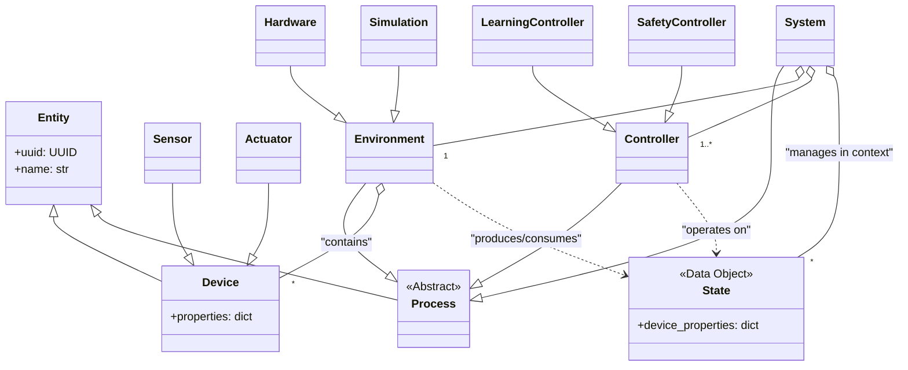

# fanctl Architecture

This document outlines the software architecture for `fanctl`, an adaptive thermal management system.

## Core Philosophy

The `fanctl` architecture automatically discovers and learns the thermal properties of the hardware it manages without manual configuration. It separates pure data (`State`) from the logic that transforms it (`Process`). Complex behaviors, including safety overrides and hierarchical control, are achieved by combining simple, composable building blocks in a well-defined pipeline.

## Key Abstractions and Data Models

### Entity

The `Entity` class serves as the foundational base for all objects within the system. Each entity has a unique identifier (`uuid`) and a human-readable name. Through inheritance from `pydantic.BaseModel`, entities support serialization to formats like JSON. All core classes such as `Device`, `Process`, and `System` inherit from `Entity` to ensure consistent identification and serialization across the architecture.

### Data Models

The `Device` class represents a single interface point with the hardware. It holds a flexible properties dictionary that can store arbitrary key-value pairs like value, min, max, label, hwmon_path, scale, and ratio. Two specialized device types exist: `Sensor` for reporting values from the environment (like temperature or fan RPM), and `Actuator` for performing actions (like fan PWM control).

A `State` represents a snapshot of device properties at a single moment in time, implemented as a set of Devices. States are unopinionated about their meaning; their role (like "actual" or "desired") is defined by how a `Process` uses them. For example, a state might contain `{ "cpu_temp": {"value": 72}, "case_fan": {"value": 1250} }`.

### Process

The `Process` class represents computational units that transform data within the system. Each process maintains a dictionary of named states and an ordered list of child processes that form a serial execution pipeline. Processes can look up contained entities by name, uuid, or type. The base `Process` class defines an abstract execute method that subclasses implement with their specific logic.

A `Process` that interfaces with hardware is called an `Environment`. It can read actuators and read/write sensors through `read()` and `apply()` methods. Most environments only write sensors, though simulated environments may read actuators to modify sensors.

A `Controller` contains decision-making logic. It receives a state object and produces a new state object representing proposed settings for one or more actuators.

### System

The `System` class orchestrates the overall operation of the application. It manages an environment and an ordered pipeline of controllers, maintaining a dictionary of named states that includes the current system state ("actual") and target state ("desired"). During each update cycle, the system executes its pipeline in sequence, allowing each controller to transform states toward desired outcomes.

Systems can publish and receive custom composite states, enabling abstraction and inter-system communication. Because a system is itself a process, it can be included within higher-level systems to build multi-layered architectures.

## Concrete Implementations

The `Hardware` environment interfaces with physical hardware through the Linux hwmon filesystem. It discovers available sensors and actuators, populates its device list, and implements read/apply methods for real-world interaction. It may create composite devices like an average CPU temperature.

The `Simulation` environment creates a virtual world containing virtual devices and a mathematical model defining their relationships. It enables testing controllers in a repeatable, deterministic way.

The `SafetyController` implements fail-safe logic. It checks for critical conditions in the actual state and, if triggered, returns a state that overrides other controllers to put the system into a safe mode. It should be the last controller in the pipeline.

The `PIDController` implements standard Proportional-Integral-Derivative control. It watches a specific sensor's value, compares it to a target from the desired state, and computes actuator values to minimize error. Multiple instances can control different loops independently.

The `LearningController` uses an Echo State Network to learn relationships between devices. It works to satisfy goals while potentially optimizing for factors like noise or power by observing the entire system state.

## The Execution Pipeline

The system's main loop follows a consistent pattern:

## Class Hierarchy

## Hierarchical Composition

A system's default representation as a process is its own internal actual state. However, a system can synthesize its own composite state or set of states for publishing to the outside world. This enables building complex control systems by composing simpler, self-contained systems that expose high-level state summaries.

## Testing

The architecture supports testing through the simulation environment. Developers can craft specific, deterministic states to test controller logic without physical hardware.
