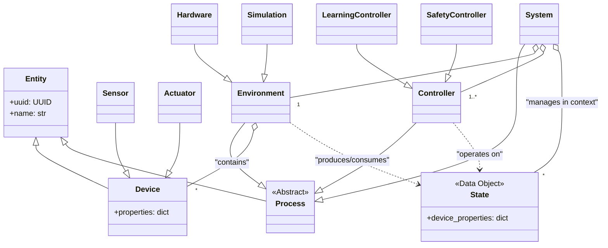

# fanctl Architecture

This document outlines the software architecture for `fanctl`, an adaptive thermal management system. It serves as the foundational blueprint for development, reflecting the latest design decisions.

## 1. Core Philosophy

The `fanctl` architecture is guided by three core principles:

-   **Zero-Configuration**: The system is designed to automatically discover and learn the thermal properties of the hardware it manages without requiring manual configuration.
-   **Data-Driven Logic**: The architecture is built on a clean separation of pure data (`State`) and the logic that transforms it (`Process`).
-   **Safety and Extensibility Through Composition**: Complex behaviors, including safety overrides and hierarchical control, are achieved by combining simple, composable building blocks in a well-defined pipeline.

## 2. Key Abstractions and Data Models

The architecture is defined by a few key concepts that represent the system's data and logical structure.

### 2.0. Entity

**Purpose**:

The `Entity` class serves as the foundational base for all objects within the system, encapsulating common attributes and behaviors that promote consistency, serialization, and unique identification across the architecture.

**Key Responsibilities**:

- **Unique Global Identification**:
  - Assigns a universally unique identifier (`uuid`) upon instantiation using `uuid.uuid4()`.
  - Ensures every object can be distinctly referenced throughout the system, facilitating tracking and management.

- **Human-Readable Naming**:
  - Provides a `name` attribute for easy identification and interaction by developers and system components.

- **Serialization and Validation**:
  - Inherits from `pydantic.BaseModel`, enabling robust data validation and serialization to formats like JSON.
  - Simplifies data exchange between processes, storage, and external systems.

- **Uniform Interface**:
  - Establishes a consistent structure for all derived classes, promoting code reusability and easier maintenance.

**Benefits**:

- **Simplified Serialization**:
  - Facilitates seamless conversion of objects to and from serializable formats essential for configuration, logging, and network communication.

- **Flexible Object Management**:
  - Supports flexible lookup and management through shared attributes like `uuid` and `name`.
  - Enhances introspection capabilities, allowing dynamic querying and manipulation of objects.

**Usage**:

- All core classes such as `Device`, `Process`, and `System` inherit from `Entity`.
- Encourages a design where objects can be easily serialized, identified, and managed uniformly.

### 2.1. Data Models

These classes represent the "nouns" of the system—the data and state that the logic operates on.

- **Device**: The base representation for any single interface point with the hardware. Its primary responsibility is to hold a flexible `properties` dictionary. This allows it to represent any kind of hardware by storing arbitrary key-value pairs (e.g., `value`, `min`, `max`, `label`, `hwmon_path`, `scale`, `ratio`, etc.).
    -   **`Sensor`**: A subclass of `Device` used to signify that this device primarily reports values from the environment (e.g., a temperature sensor, a fan RPM sensor, a virtual composite sensor created from a statistical basis).
    -   **`Actuator`**: A subclass of `Device` used to signify that this device primarily performs an action in the environment (e.g., a fan PWM control, a pump speed control).

- **State**: A pure data object that represents a snapshot of various device properties at a single moment in time. It is implemented as a set of Devices. A `State` is unopinionated about its meaning; its role (e.g., "actual", "desired") is defined by the context in which it is used by a `Process`.
    -   *Example*: `{ "cpu_temp": {"value": 72}, "case_fan": {"value": 1250} }`

### 2.1. Process

**Purpose**:

The `Process` class represents the core computational units within the system that perform data transformations and logic execution. It serves as an abstract base class for all processes, including `Controller`, `Environment`, and `System`.

**Key Responsibilities**:

- **State Management**:
  - Maintains a dictionary of named `State` objects (`states: Dict[str, State]`), representing various data snapshots relevant to the process.
  - Allows for organized access and manipulation of different states during execution.

- **Process Pipeline Execution**:
  - Manages an ordered list of child `Process` instances (`processes: List[Process]`), facilitating serial execution and data flow.
  - Each child process transforms input states and passes the results to the next process in the pipeline.

- **Lookup Mechanisms**:
  - Implements methods to retrieve contained `Entity` objects by `name`, `uuid`, or `type`.
  - Enhances flexibility and dynamic interactions within the process hierarchy.

- **Abstract Execution Logic**:
  - Defines an abstract `execute()` method where the specific logic of the process is implemented in subclasses.
  - Ensures that all processes adhere to a consistent execution interface.

**Benefits**:

- **Composability**:
  - Processes can be nested and combined to form complex behaviors from simple, reusable components.
  - Encourages modular design and separation of concerns.

- **Extensibility**:
  - New types of processes can be created by inheriting from `Process` and implementing custom logic.
  - Supports easy integration of additional functionality as the system evolves.

- **Introspection and Management**:
  - The consistent interface and shared attributes allow for easy inspection, debugging, and management of process pipelines.

**Usage**:

- Serves as the base class for all computational entities, including `Controller`, `Environment`, and `System`.
- Enables the construction of flexible and modular data processing pipelines within the system.

- **Process**: The abstract base class for any computational unit. Its core responsibility is to define a common interface for execution. Any `Process` can be included in a `System`'s pipeline.  A Process can read one or more States and produce one State.

- **Environment**: A `Process` that can read Actuators and can read and write Sensors.  Most real Environments will only write sensors, but simulated environments may read actuators and modify sensors.
    -   Its `read()` method is responsible for querying its underlying implementation to produce an "actual" `State` object.
    -   Its `apply()` method is responsible for taking a `State` object containing actuator settings and applying it.

- **Controller**: A `Process` whose responsibility is to contain decision-making logic. It receives a `State` object and produces a new `State` object that represents its proposed settings for one or more `Actuator`s.

- **System**:

**Purpose**:

The `System` class is the top-level orchestrator of the architecture, responsible for coordinating the overall operation of the application. By inheriting from `Process`, it integrates seamlessly into the process pipeline and can be nested within other systems.

**Key Responsibilities**:

- **Environment Integration**:
  - Manages a single `Environment`, which interfaces with hardware or simulations to read and apply `State`s.
  - Acts as the bridge between the abstract processes and the concrete implementation.

- **Controller Pipeline Management**:
  - Maintains an ordered pipeline of one or more `Controller`s, each implementing specific decision-making logic.
  - Ensures that control logic is applied sequentially to transform states toward desired outcomes.

- **Contextual State Management**:
  - Manages a dictionary of named `State`s (`context`), including essential states like `"actual"` (current system state) and `"desired"` (target state).
  - Facilitates shared access to states across processes and controllers.

- **Execution Cycle Coordination**:
  - Executes the process pipeline in a well-defined order during each update cycle, ensuring consistent data flow and processing.
  - Handles timing and synchronization aspects of the system operation.

- **State Publishing and Abstraction**:
  - Publishes and receives custom composite `State`s, enabling abstraction and inter-system communication.
  - Allows the `System` to expose high-level summaries of its internal state for integration with other systems.

- **Composability**:
  - Serves as a `Process` itself, allowing it to be included within higher-level `System`s and supporting hierarchical system design.
  - Promotes scalability by enabling complex systems to be built from simpler subsystems.

**Benefits**:

- **Scalability and Modularity**:
  - Supports building complex, scalable architectures through composition and modular design.
  - Encourages separation of concerns and cleaner organization of system components.

- **Flexibility**:
  - Allows dynamic reconfiguration of processes, controllers, and states within the system.
  - Adapts to a wide range of use cases, from simple applications to complex, distributed systems.

- **Interoperability**:
  - Facilitates communication between different systems and components through standardized state publishing.
  - Enhances the ability to integrate with external systems or services.

**Usage**:

- Acts as the primary control unit in the application, orchestrating interactions between the environment, controllers, and processes.
- Can be nested within other systems to build multi-layered architectures, promoting reuse and abstraction.

## 3. Concrete Implementations

The following are the key concrete implementations of the abstract `Process` classes.

-   **`Hardware` (Environment)**: This class interfaces with the physical hardware of the machine, typically via the Linux `hwmon` filesystem. It discovers available sensors and actuators, populates its `Device` list, and implements the `read()` and `apply()` methods to interact with the real world. It may also create composite or virtual `Device`s (e.g., an average CPU temperature).

-   **`Simulation` (Environment)**: This class creates a virtual world. It contains a set of virtual `Device`s and a mathematical model that defines their relationships. It is used for testing `Controller`s in a repeatable, deterministic way.

-   **`SafetyController` (Controller)**: A simple, rule-based `Controller` that acts as a fail-safe. Its logic is to check for critical conditions in the `actual_state` (e.g., temperature exceeding a hard limit). If a condition is met, it returns a `State` that overrides all other `Controller`s and puts the system into a safe mode (e.g., all fans to 100%). It should always be the last `Controller` in the pipeline.

-   **`PIDController` (Controller)**: A standard Proportional-Integral-Derivative controller. It will be configured to watch a specific `Sensor`'s value, compare it to a target value from a `desired_state`, and compute a new value for a specific `Actuator` to minimize the error. Multiple instances can be used in a pipeline to control different loops independently.

-   **`LearningController` (Controller)**: The most complex `Controller`. It uses an Echo State Network to learn the relationships between all `Device`s in the system. It works to satisfy the goals in a `desired_state` while potentially optimizing for other factors (like minimizing noise or power) by observing the entire system `State`.

## 4. The Execution Pipeline and State Context

The `System` ensures predictable and safe behavior by managing a dictionary of named `State` objects, called the `context`. The main loop is as follows:

1.  **Initialize Context**: The `System` initializes an empty `context` dictionary: `Dict[str, State]`.
2.  **Read Actual State**: The `System` calls its `Environment`'s `read()` method. The returned `State` object is placed into the context with the reserved key `"actual"`.
3.  **Load Profile States**: The `System` loads one or more `State`s from a `Profile` file (e.g., `performance_goals`, `silent_goals`) and adds them to the `context`.
4.  **Execute Controller Pipeline**: The `System` iterates through its ordered list of `Controller`s. Each `Controller` receives the `context` and returns a `State` of proposed actuator settings. The output `State` from one `Controller` becomes an input to the next.
5.  **Apply Final State**: The final `State` object from the last `Controller` in the pipeline contains the target settings for the actuators for the current cycle. The `System` compares this final `State` to the `actual`. If they differ, the `System` passes the final `State` to its `Environment`'s `apply()` method.
6.  **Sleep**: The `System` process then sleeps for a configured interval before starting the next update cycle.

## 5. Class Hierarchy

The following diagram illustrates the complete, integrated class hierarchy.

## 6. Hierarchical Composition

Because a `System` is also a `Process`, it can be used as a component within a larger `System`. When a `System` is treated as a `Process`, its default representation is its own internal `"actual"` state. This allows for building complex control systems (e.g., for a data center) by composing simpler, self-contained systems that expose a high-level summary of their state.

## 7. Testing Strategy

The architecture is inherently testable. A test `System` can be configured to use a `Simulation` as its `Environment`. This allows developers to craft specific, deterministic `State` objects to test `Controller` logic under a wide range of conditions without needing physical hardware.
