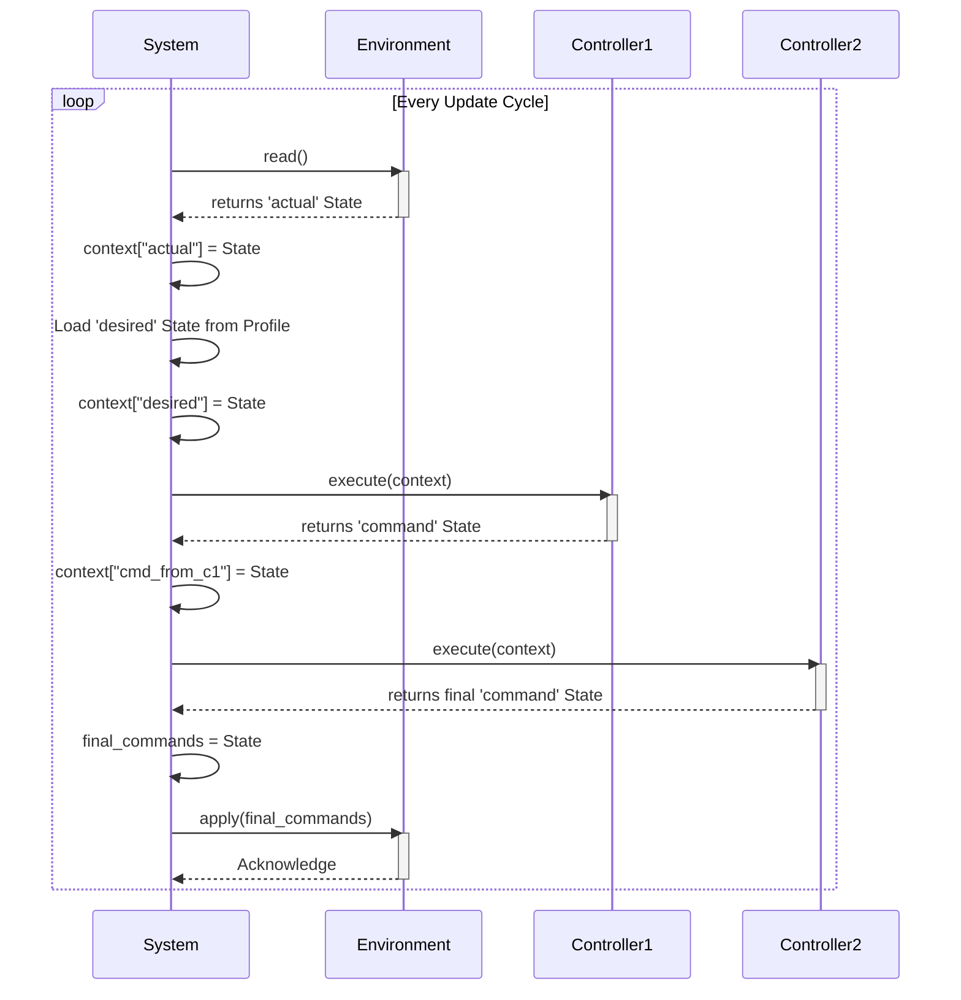

# fanctl Architecture

This document outlines the software architecture for `fanctl`, an adaptive thermal management system. It serves as the foundational blueprint for development, reflecting the latest design decisions.

## 1. Core Philosophy

The `fanctl` architecture is guided by three core principles:

*   **Zero-Configuration**: The system is designed to automatically discover and learn the thermal properties of the hardware it manages without requiring manual configuration.
*   **Data-Driven Logic**: The architecture is built on a clean separation of pure data (`State`) and the logic that transforms it (`Process`).
*   **Safety and Extensibility Through Composition**: Complex behaviors, including safety overrides and hierarchical control, are achieved by combining simple, composable building blocks in a well-defined pipeline.

## 2. Key Abstractions

The architecture is defined by a few key concepts:

*   **`Device`**: A class representing a single hardware interface point. It holds a flexible dictionary of properties (e.g., `value`, `min`, `max`, `label`) to accommodate a wide variety of hardware.
    *   **`Sensor`**: A `Device` that primarily reports values from the environment.
    *   **`Actuator`**: A `Device` that primarily performs an action in the environment.

*   **`State`**: A pure data object, implemented as a dictionary, that represents a collection of device properties at a moment in time. A `State` is unopinionated about its meaning; it is simply data. Its role (e.g., "actual", "desired", "command") is defined by the context in which it is used.
    *   Example: `{ "cpu_temp": {"value": 72}, "case_fan": {"value": 1250} }`

*   **`Process`**: The abstract base class for any logical unit. A `Process` is a self-contained component whose primary role is to transform `State` objects.
    *   **`Environment`**: A `Process` that represents the state of the world. It reads the physical state of hardware (or a simulation) into an "actual" `State` object and applies a final "command" `State` to the hardware.
    *   **`Controller`**: A `Process` that contains control logic. It receives a context of named `State` objects and produces a new `State` object representing proposed actuator commands.

*   **`System`**: The top-level orchestrator. It manages the execution pipeline, including its `Environment`, an ordered list of `Controller`s, and the `State` context. A `System` is also a `Process`, which allows for powerful hierarchical composition.

## 3. The Execution Pipeline and State Context

The `System` ensures predictable and safe behavior by managing a dictionary of named `State` objects, called the `context`.

1.  **Initialize Context**: The `System` initializes an empty `context` dictionary: `Dict[str, State]`.
2.  **Read Actual State**: The `System` calls its `Environment`'s `read()` method. The returned `State` object is placed into the context with the reserved key `"actual"`. This `"actual"` state is the default and represents the current physical reality.
3.  **Load Profile States**: The `System` loads one or more `State`s from a `Profile` file (e.g., `performance_goals`, `silent_goals`) and adds them to the `context` under their given names.
4.  **Execute Controller Pipeline**: The `System` iterates through its ordered list of `Controller`s. Each `Controller` receives the *entire* `context` dictionary. It can use any `State`s it needs to perform its logic. The `State` returned by one `Controller` becomes the input for the next, typically representing a refined set of commands.
5.  **Commit to Hardware**: The final `State` object from the last `Controller` in the pipeline is the "command" state. The `System` passes this `State` to its `Environment`'s `apply()` method to be written to the physical hardware.



## 4. Class Hierarchy

The following diagram illustrates the complete, integrated class hierarchy, showing the separation between the data model and the process model.

```mermaid
classDiagram

    subgraph DataModel [Data Model]
        direction TB
        Device {
            +properties: dict
        }
        Sensor --|> Device
        Actuator --|> Device
        State {
            <<Data Object>>
            +device_properties: dict
        }
    end

    subgraph ProcessModel [Process Model]
        direction TB
        Process {
            <<Abstract>>
        }
        Controller --|> Process
        Environment --|> Process
        System --|> Process

        LearningController --|> Controller
        SafetyController --|> Controller

        Hardware --|> Environment
        Simulation --|> Environment
    end

    System o-- "1" Environment
    System o-- "1..*" Controller
    System o-- "*" State : "manages in context"

    Controller ..> State : "operates on"
    Environment ..> State : "produces/consumes"
    Environment o-- "*" Device : "contains"

```

## 5. Hierarchical Composition

Because a `System` is also a `Process`, it can be used as a component within a larger `System`. When a `System` is treated as a `Process`, its default representation is its own internal `"actual"` state. This allows for building complex control systems (e.g., for a data center) by composing simpler, self-contained systems that expose a high-level summary of their state.

## 6. Testing Strategy

The architecture is inherently testable. A test `System` can be configured to use a `Simulation` as its `Environment`. This allows developers to craft specific, deterministic `State` objects to test `Controller` logic under a wide range of conditions without needing physical hardware.
