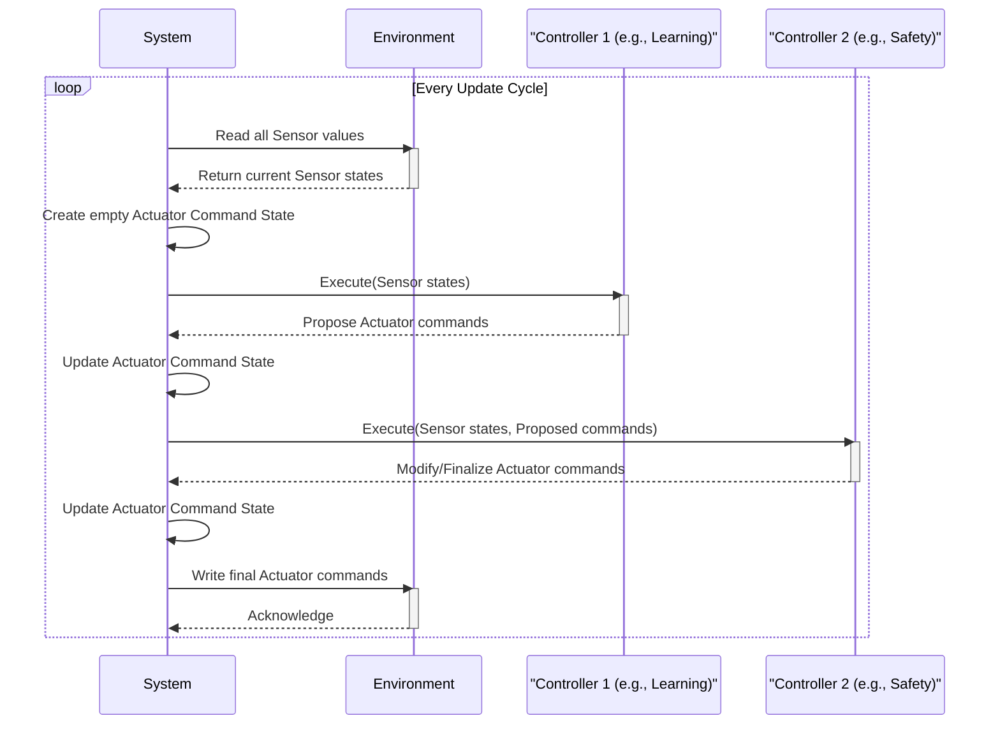
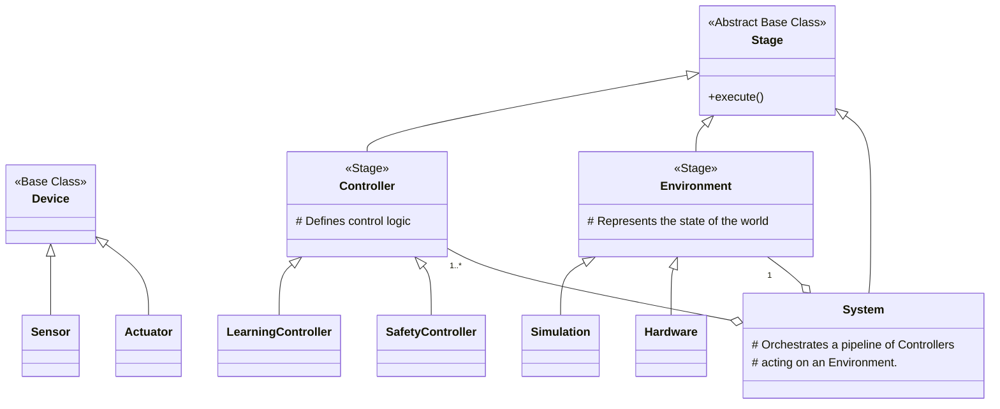

# fanctl Architecture

This document outlines the software architecture for `fanctl`, an adaptive thermal management system. It serves as the foundational blueprint for development.

## 1. Core Philosophy

The `fanctl` architecture is guided by three core principles:

*   **Zero-Configuration**: The system is designed to automatically discover and learn the thermal properties of the hardware it manages without requiring manual configuration of zones, sensors, or fans.
*   **Learning-Based Control**: At its core, `fanctl` uses machine learning (specifically, Echo State Networks) to model the relationship between thermal sensors and cooling actuators, enabling intelligent and adaptive control.
*   **Safety and Extensibility Through Composition**: The architecture is built on a small set of composable primitives. Complex behaviors, including safety overrides and hierarchical control, are achieved by combining these simple building blocks in a well-defined pipeline.

## 2. Key Abstractions

The architecture is defined by a few key abstract concepts.

*   **Device**: The most fundamental unit, representing a single interface point with the hardware. It is subclassed into:
    *   **`Sensor`**: A read-only `Device` that reports a value from the environment (e.g., a temperature sensor).
    *   **`Actuator`**: A write-only `Device` that performs an action in the environment (e.g., setting a fan's speed).

*   **Stage**: An abstract base class for any logical unit in the processing pipeline. A `Stage` is a self-contained component that performs a specific part of the overall logic. It is subclassed into:
    *   **`Environment`**: A `Stage` that represents the state of the world. It contains all the `Sensor`s and `Actuator`s and defines how the world behaves.
    *   **`Controller`**: A `Stage` that contains control logic. It reads from `Sensor`s and computes commands for `Actuator`s to achieve a desired outcome.

*   **System**: The top-level orchestrator that manages the execution pipeline. It contains one `Environment` and an ordered list of `Controller`s. Crucially, a `System` is also a `Stage`, which allows for powerful hierarchical composition.

## 3. The Execution Pipeline

The `System` ensures predictable and safe behavior by executing its `Stage`s in a strict, well-defined pipeline during each update cycle.

1.  **Read World State**: The `System` first reads the current values from all `Sensor`s within its `Environment`.
2.  **Initialize Command State**: A temporary, internal "command state" is created to hold the desired values for all `Actuator`s. This state is mutable and will be modified by the controller pipeline.
3.  **Execute Controller Pipeline**: The `System` iterates through its ordered list of `Controller`s. Each `Controller` receives the sensor readings and the current command state, and can propose new actuator commands, overwriting the values in the command state. This allows later stages to override earlier ones (e.g., a safety controller overriding a learning controller).
4.  **Commit to Hardware**: Only after the entire controller pipeline has executed does the `System` take the final, sanitized command state and write the values to the actual `Actuator`s in the `Environment`.

This sequence ensures that hardware is only touched once per cycle with the final, validated commands.

## 4. The Class Hierarchy

The following diagram illustrates the relationships between the core classes.

### Concrete Implementations

*   **`LearningController`**: A `Controller` that uses an Echo State Network to learn thermal relationships and predict optimal actuator commands.
*   **`SafetyController`**: A simple, rule-based `Controller` that enforces hard limits (e.g., maximum temperature, minimum fan speed).
*   **`Hardware`**: An `Environment` that interfaces directly with the physical hardware of the local machine (e.g., via the Linux `hwmon` interface).
*   **`Simulation`**: An `Environment` that uses a mathematical model to simulate thermal dynamics, used primarily for testing and validation.

## 5. Permissions and Data Flow

To enforce the conceptual separation of concerns, the architecture does not rely on runtime permission checks. Instead, it uses **interface segregation** through proxy objects.

When the `System` executes a `Stage`, it provides temporary, restricted views of the `Device`s that expose only the necessary functionality. For example, a `Controller` receives a read-only collection of sensors and a write-only proxy to the actuator command state. This is a Pythonic approach that makes it impossible for a `Controller` to, for instance, directly change a `Sensor`'s value.

## 6. Hierarchical Composition

The architecture's most powerful feature is its support for hierarchy. Because a `System` is itself a `Stage`, it can be used as a component within a larger `System`.

This is achieved by using a `System` as part of the `Environment` of a higher-level `System`. For example, a `Rack_System` can have an `Environment` that contains multiple `PC_System` objects. The `Rack_System` does not interact with the individual sensors/actuators of the PCs; it only sees the virtual, aggregated `Sensor`s (e.g., `TotalPowerDraw`) and `Actuator`s (e.g., `CoolingMode`) that each `PC_System` chooses to expose.

This allows for building complex control systems (e.g., for a data center) by composing simpler, self-contained systems.

## 7. Testing Strategy

The architecture is inherently testable. By swapping the `Environment` of a `System`, we can test `Controller` logic without needing physical hardware. A typical test `System` will use a `Simulation` as its `Environment`. This allows us to create specific, deterministic, and repeatable test scenarios to validate the behavior of controllers under a wide range of conditions, including edge cases and failure modes.
