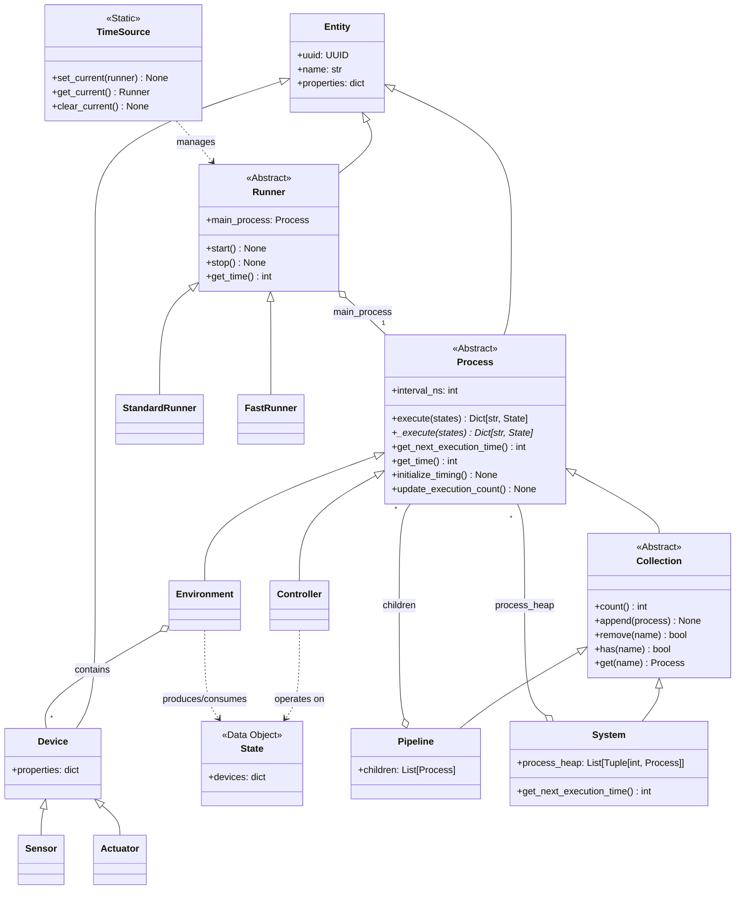

# aifand Architecture

This document outlines the software architecture for `aifand`, an adaptive thermal management system designed for both local and remote operation across multiple network protocols.

## Core Philosophy

The `aifand` architecture automatically discovers and learns the thermal properties of hardware without manual configuration. It separates pure data (`State`) from logic that transforms it (`Process`), enabling complex behaviors through composable building blocks. The system supports multiple network protocols for remote monitoring and control while maintaining a single source of truth through pydantic models.

## Key Abstractions and Data Models

### Entity

The `Entity` class serves as the foundational base for all objects within the system. Each entity has a unique identifier (`uuid`) and human-readable name, with support for arbitrary additional properties through pydantic's `extra="allow"` configuration.

Implementation details include inheritance from `pydantic.BaseModel` with `frozen=True` for immutability, automatic UUID generation via `uuid4()` if not provided, support for arbitrary key-value pairs alongside core fields, full JSON serialization and deserialization support, and string representation showing all fields for debugging.

All core classes (`Device`, `Process`, `Collection`, `Runner`) inherit from `Entity` to ensure consistent identification, serialization, and extensibility across the architecture.

### Data Models

The `Device` class represents a single interface point with hardware. It extends Entity with a flexible properties dictionary storing arbitrary key-value pairs like value, min, max, label, hwmon_path, scale, and unit. Standard property naming conventions ensure consistency across thermal management operations.

Two specialized device types exist: `Sensor` for reporting values from the environment (temperature, fan RPM), and `Actuator` for performing actions (fan PWM control, thermal limits).

A `State` represents a snapshot of device properties at a specific moment, implemented as an immutable collection of Devices indexed by name. States are unopinionated about their meaning; their role (like "actual" or "desired") is defined by how a `Process` uses them. States provide helper methods for device access, addition, and removal while maintaining immutability through copy-on-write semantics.

### Process

The `Process` class represents computational units that transform thermal management data. Process provides a template method `execute()` that calls the abstract `_execute()` method and automatically updates execution count. Subclasses implement `_execute()` to define their transformation logic. Process is a pure execution unit with no persistent state storage and no children.

Process includes timing infrastructure with `interval_ns` field for execution intervals, `start_time` for timing loop initialization, `execution_count` for tracking completed cycles, and `get_next_execution_time()` method for calculating when next execution should occur using modulo timing. The timing system uses nanosecond precision with `get_time()` method that automatically uses runner-provided time sources when available, falling back to `time.monotonic_ns()`.

Process execution characteristics include immutable data flow where input states are never modified, error resilience where exceptions are caught and logged without aborting thermal control, and per-process logging with hierarchical logger names.

Device modification permissions enforce thermal management domain rules through runtime validation. Environment processes can read and modify Sensors but can only read Actuators from their input state (hardware interface responsibility), while Controller processes can only modify Actuators but can only read Sensors from their input state (decision-making responsibility). This separation prevents Controllers from corrupting sensor readings and prevents Environments from bypassing controller decisions. Permission checking uses call stack inspection to identify the modifying process and validates against a class-based permission matrix.

An `Environment` can read and modify sensors but should only read actuators from its input state. A `Controller` can read and modify actuators but should only read sensors from its input state.

### Collection

The `Collection` class defines the coordination protocol for managing multiple processes. Collection inherits from Process and adds abstract methods for process management: `count()` returns the number of processes, `append()` adds a process, `remove()` removes a process by name, `has()` checks if a process exists, and `get()` retrieves a process by name.

Collection uses duck typing and specifies no internal container type. Any object that can store processes, determine execution timing, and coordinate execution is a valid Collection implementation. Collections are coordination abstractions containing no data structures themselves, just the protocol for managing processes.

Collection inherits timing capabilities from Process, allowing Collections to participate in hierarchical timing coordination while implementing their own storage and execution strategies. Collections propagate `initialize_timing()` to all child processes to ensure clean timing state throughout the process hierarchy.

### Pipeline

The `Pipeline` class implements serial execution coordination for thermal control flows. Pipeline inherits from Collection and manages an ordered list of child processes in its `children` field, executing them sequentially where each child's output becomes the next child's input.

Pipeline execution passes states through children serially: input → child1.execute() → child2.execute() → ... → output. The `execute()` method iterates through children, calling each child's execute method with the current states and passing the result to the next child. Error handling catches exceptions, logs them, and continues with the next child to maintain thermal control operation.

Collection protocol implementation uses the children list directly: `count()` returns `len(children)`, `append()` adds to the list, `remove()` searches by name and removes matching processes, and `has()`/`get()` search the list by process name.

Pipeline maintains its own execution timing inherited from Process but does not store persistent state between executions. It coordinates timing for serial execution while children manage their own internal state.

### System

The `System` class implements parallel execution coordination for multiple independent thermal control flows. System inherits from Collection and manages child processes in a priority queue implemented as `process_heap: List[Tuple[int, Process]]` using Python's `heapq` module for efficient timing-based coordination.

System execution finds processes ready to execute based on their individual timing preferences. The `_get_ready_children()` method queries the priority queue to find processes whose `get_next_execution_time()` is less than or equal to current time. Ready processes execute independently with empty states (state isolation), and after execution they are re-added to the priority queue with updated next execution times.

System delegates its own timing to children through `get_next_execution_time()`, which returns the earliest child's next execution time rather than using System's own timing interval. This enables event-driven coordination where System executes precisely when children need to execute, avoiding polling.

Collection protocol implementation operates on the priority queue: `append()` calculates the process's next execution time and pushes it onto the heap, `remove()` searches the heap and re-heapifies after removal, and `has()`/`get()` search through heap tuples by process name.

System enables coordination across thermal zones with different update rates and characteristics. Children execute when ready based on their individual timing requirements rather than synchronized intervals, allowing CPU thermal management at 100ms intervals while storage thermal management operates at 1000ms intervals within the same System.

### Runner

The `Runner` class provides autonomous execution management for thermal management processes. Runner manages the execution lifecycle, calling a main process's `execute()` method according to the process's timing preferences while running in a separate thread for non-blocking operation.

The `TimeSource` class encapsulates time source discovery using thread-local storage, enabling different runners to provide different time sources to processes executing in their threads. This abstraction supports both real-time execution and accelerated simulation testing.

`StandardRunner` implements production execution that respects real-time timing, sleeping between executions to maintain proper intervals. It provides monotonic time to executed processes and handles graceful shutdown with proper thread cleanup.

`FastRunner` implements accelerated execution for testing, maintaining internal simulation time that advances instantly to the next execution time without real delays. FastRunner sets itself as the time source before initializing timing to ensure processes use simulation time (starting at 0) rather than wall clock time. The `run_for_duration()` method enables deterministic testing of long-term thermal behavior in milliseconds rather than hours.

Runner integration enables autonomous thermal management operation through `StandardRunner` and rapid testing of complex timing scenarios through `FastRunner`. Both runners initialize timing state for the entire process hierarchy and provide error resilience to maintain thermal control operation.

## Concrete Implementations

The following implementations exist as skeleton classes requiring completion:

### Environments

The `Hardware` environment will interface with physical hardware through the Linux hwmon filesystem, discovering available sensors and actuators and implementing read/apply methods for real-world interaction.

The `Simulation` environment will create virtual thermal models for controller testing, including linear thermal models, thermal mass simulation, realistic system models, unstable system models, failure simulation, and chaotic system models.

### Controllers

The `SafetyController` will implement fail-safe logic, monitoring actual state against critical thresholds and overriding other controllers when triggered.

The `PIDController` will implement standard Proportional-Integral-Derivative control with anti-windup and derivative filtering.

The `LearningController` will use Echo State Networks to learn thermal relationships and optimize for multiple objectives.

## Class Hierarchy

## Autonomous Execution Architecture

The Runner architecture enables autonomous thermal management operation by separating timing coordination from thermal management logic. StandardRunner provides production execution with real-time timing, while FastRunner enables accelerated testing for rapid validation of complex timing scenarios.

The TimeSource abstraction uses thread-local storage to provide time sources to processes, enabling both real-time operation and deterministic simulation testing. Process.get_time() automatically uses runner-provided time when available, ensuring consistent timing behavior across execution contexts.

Runner lifecycle management includes initialization of the entire process hierarchy timing state, graceful shutdown with proper thread cleanup, and error resilience to maintain thermal control operation despite individual process failures.

## Protocol Layer Architecture

The protocol layer enables remote thermal management across multiple network protocols while maintaining protocol-agnostic core logic. All protocols expose the same underlying pydantic thermal models through different transport mechanisms.

Protocol implementations will include gRPC for high-frequency sensor data streaming and real-time control commands, HTTP/REST for configuration management and status queries, MQTT for distributed sensor networks and pub/sub thermal alerts, WebSocket for real-time dashboard updates, and Prometheus for metrics collection and alerting.

## Serialization Strategy

The architecture uses pydantic models as the single source of truth for all data structures, ensuring consistency across protocols and eliminating schema drift. Thermal entities are defined once as pydantic models and exposed across multiple protocols with automatic stub generation and full type checking across network boundaries.

## Testing Strategy

The architecture supports testing through multiple approaches targeting different system layers. Unit tests provide individual component validation with pytest. Pipeline tests validate complete Pipeline execution and controller integration. System tests focus on multi-Pipeline coordination and parallel execution validation.

FastRunner enables rapid testing of long-term thermal behavior and complex timing scenarios without wall-clock delays. Simulation tests will evaluate controller behavior against mathematical thermal models, providing controlled environments for testing control algorithms without requiring physical hardware.

Hardware tests will conduct real-world validation using actual thermal management hardware. Protocol tests will verify multi-protocol serialization and network communication. The simulation environments will enable testing controller stability against both reasonable thermal models and deliberately pathological edge cases.

## Implementation Decisions

**Process Simplicity**: The base Process class provides only execution capability (`execute()`) and timing infrastructure (`get_next_execution_time()`). No children, no persistent state, no complex coordination. This separation enables both simple transformations (Controllers, Environments) and complex coordination (Pipeline, System) through composition.

**Collection Protocol**: Collection defines a coordination interface without specifying container implementation. Pipeline uses a list for serial execution, System uses a priority queue for timing-based parallel coordination. This duck-typed approach enables different storage strategies while maintaining consistent management interface.

**Timing Separation**: Process knows when it wants to execute (`get_next_execution_time()`), Collections coordinate when execution actually occurs, Runner manages autonomous execution lifecycle. This separation enables Pipeline's unified timing (all children execute together) and System's delegated timing (System executes when any child is ready) using the same Process timing interface. System delegates timing to children to achieve event-driven coordination rather than polling.

**Runner Architecture**: Runner provides autonomous execution management with TimeSource abstraction enabling both real-time and accelerated testing. StandardRunner respects process timing for production operation, FastRunner accelerates time for rapid testing validation.

**Permission Enforcement**: Runtime validation prevents Controllers from modifying sensors and prevents Environments from modifying actuators. Call stack inspection identifies the modifying process and validates against domain rules, preventing thermal management violations during execution.

**Immutable Data Flow**: State objects are immutable with copy-on-write semantics, ensuring safe data flow through process pipelines while preventing accidental modification that could corrupt thermal control calculations.

**Thread-Local Time Sources**: TimeSource uses thread-local storage to provide time sources to processes, enabling different runners to operate independently in different threads while maintaining consistent timing behavior within each execution context.